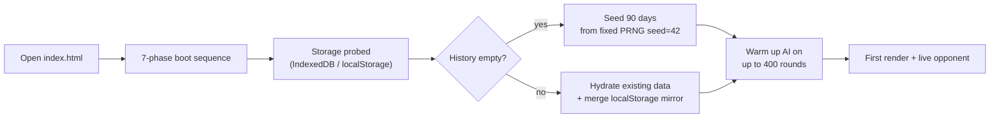
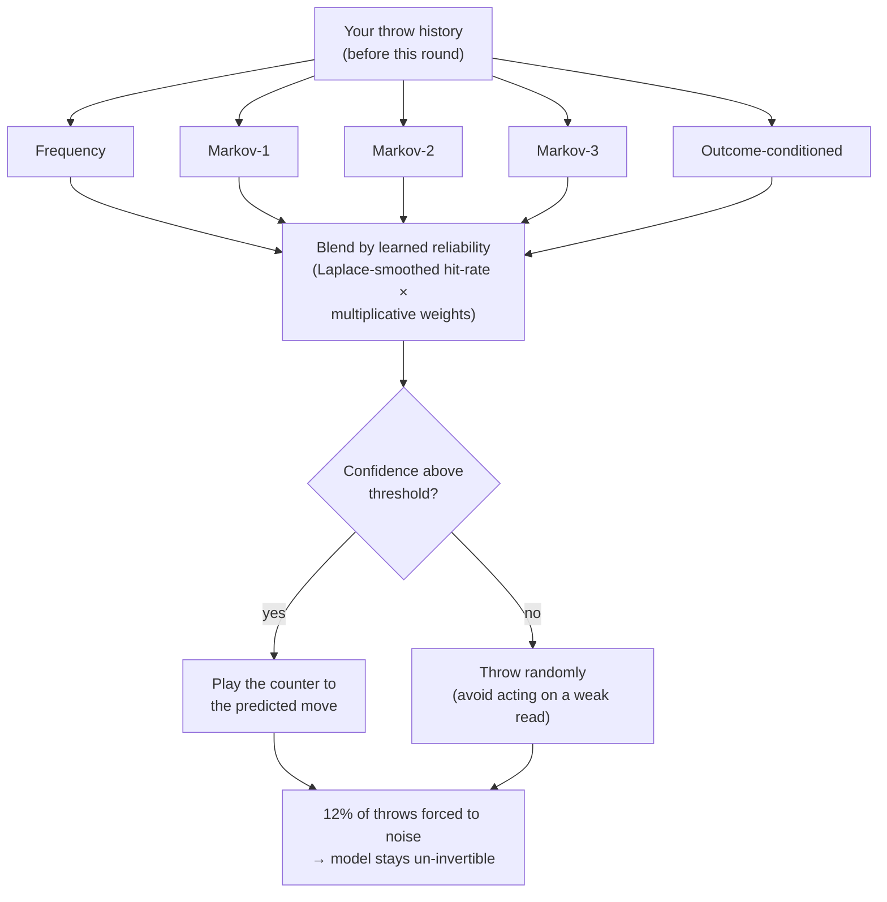
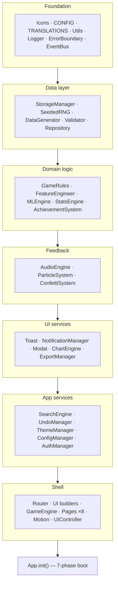
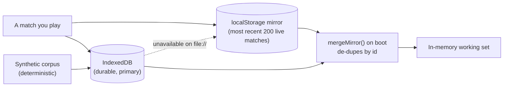

# RPS Arena

> **Rock Paper Scissors against an opponent that actually learns you.**

A single-file, zero-install progressive web app. Open `index.html` in a browser and it
works — no build step, no `npm install`, no server, no network account. Everything runs
client-side and persists locally.

> [!TIP]
> On first run the app generates 90 days of synthetic match history from a fixed seed so no
> screen is ever empty, then hands you a live opponent. There is nothing to configure before
> you can play.

---

## Table of contents

1. [Overview — why this exists](#1-overview--why-this-exists)
2. [Prerequisites](#2-prerequisites)
3. [Quick start](#3-quick-start)
4. [The opponent](#4-the-opponent)
5. [Feature map](#5-feature-map)
6. [Keyboard reference](#6-keyboard-reference)
7. [Architecture](#7-architecture)
8. [Data model](#8-data-model)
9. [Design system](#9-design-system)
10. [Accessibility](#10-accessibility)
11. [Internationalisation](#11-internationalisation)
12. [Privacy & offline behaviour](#12-privacy--offline-behaviour)
13. [Verification](#13-verification)
14. [Troubleshooting](#14-troubleshooting)
15. [FAQ](#15-faq)
16. [Browser support](#16-browser-support)
17. [Known limitations](#17-known-limitations)
18. [Project stats](#18-project-stats)
19. [Files](#19-files)

---

## 1. Overview — why this exists

Rock Paper Scissors is trivially "solved": throw uniformly at random and no opponent can
beat you long-run. The interesting problem is the other direction — **humans cannot throw
randomly.** We repeat after winning, switch after losing, cycle rock → paper → scissors,
and over-open with rock.

RPS Arena is built around that asymmetry. The app is an instrument for measuring how
predictable you are, wrapped in a game that punishes you for it.

> [!NOTE]
> **What "the AI learns you" means precisely.** The opponent builds a live statistical model
> of your throw history and predicts your *next* move, then plays the counter. It only ever
> trains on history that existed **before** your current throw — it never peeks. See
> [The opponent](#4-the-opponent) for the full method and the measured evidence that it beats
> a patterned player but *cannot* beat a random one.

---

## 2. Prerequisites

There is no toolchain to install to **play** the app. There is a small, optional toolchain to
**re-verify** it.

| To do this | You need | Notes |
|---|---|---|
| **Play the game** | Any modern browser | Chrome/Chromium is the only *verified* engine — see [Browser support](#16-browser-support). |
| **Full IndexedDB persistence** | Serve over `http://localhost` or `https://` | On a bare `file://` origin IndexedDB is silently disabled — see [Troubleshooting](#14-troubleshooting). |
| **Re-run the syntax check** | Node.js 18+ (`node --check`) | Used only to parse the extracted script; the app itself never touches Node. |
| **Re-run the headless verification** | Chrome/Chromium with `--headless=new` | Reproduces the 8-route console-capture and functional-harness results. |

> [!TIP]
> The fastest way to get **complete** persistence (real matches *and* synthetic history
> surviving reloads) is to serve the folder locally rather than opening the file directly.
> Any static server works — for example `python -m http.server 8000` then open
> `http://localhost:8000/`.

---

## 3. Quick start

**The zero-setup path.** Double-click the file, or from a terminal:

```bash
# macOS
open index.html

# Windows (PowerShell)
Invoke-Item .\index.html

# Linux
xdg-open index.html
```

That is the entire setup. What happens on that first load:



**The full-persistence path.** Serve the folder over a local origin so IndexedDB is enabled:

```bash
# Any static server works; this uses Python's built-in one
python -m http.server 8000
# then open http://localhost:8000/ in your browser
```

> [!WARNING]
> Opening the file directly (`file://…/index.html`) is fully supported and the app degrades
> gracefully, **but** IndexedDB is disabled on that origin, so the synthetic corpus is
> regenerated on every load (deterministically, so it is identical each time) and your real
> matches are restored from a localStorage mirror instead. If you want durable IndexedDB
> storage, use the local-server path above.

---

## 4. The opponent

Four difficulty tiers. Only the top two model you at all.

| Tier | Method | Behaviour |
|---|---|---|
| **Easy** | Uniform random | Genuinely 1/3 each. Nothing to exploit, nothing exploiting you. |
| **Medium** | Frequency analysis | Counts your throws, counters your favourite once a bias emerges. |
| **Hard** | Markov chain, order 2 | Learns `P(next throw \| your last two)`. Falls back to order 1, then frequency. |
| **Adaptive** | Weighted ensemble | Five predictors vote; votes are scaled by each predictor's own measured hit-rate. |

### 4.1 How Adaptive works

Five independent predictors each propose a distribution over your next move:

1. **Frequency** — your overall move bias, exponentially decayed
2. **Markov-1** — conditioned on your last throw
3. **Markov-2** — conditioned on your last two
4. **Markov-3** — conditioned on your last three
5. **Outcome-conditioned** — win-stay / lose-shift modelling



Each vote is weighted by that predictor's Laplace-smoothed historical accuracy, so
unreliable predictors fade out automatically. Weights additionally update after every
round via multiplicative weights (`×1.06` on a hit, `×0.96` on a miss, clamped to
`[0.35, 3]`). Confidence is the margin between the top two blended probabilities, scaled
by sample depth.

Two deliberate constraints keep it honest:

> [!IMPORTANT]
> - **It never peeks.** `MLEngine.learn()` is called only *after* the round is committed, on
>   the history that existed *before* your throw.
> - **12% of throws are noise.** A perfectly deterministic counter-predictor is itself
>   predictable and can be inverted by a smart player. Exploration prevents that.

### 4.2 Measured behaviour

Against a fresh model, driven programmatically (see [Verification](#13-verification)):

| Scenario | AI win rate | Random baseline |
|---|---|---|
| Player always throws rock (300 rounds) | **91.3 – 92.3 %** | 33.3 % |
| Player throws uniformly at random (600 rounds) | **33.8 – 34.8 %** | 33.3 % |

It crushes a pattern and cannot beat true randomness. That is exactly the correct
behaviour, and it is asserted in the test harness rather than claimed.

---

## 5. Feature map

Eight routes, hash-based (`#/dashboard`, `#/play`, …).

**Dashboard** — 4 KPI tiles with sparklines and period-over-period deltas, a 90-day
performance chart with 7-day moving average and a 33.3% random baseline, outcome donut,
live activity feed, AI status panel (read-rate, model memory, predictability index),
achievement progress, quick difficulty launchers, one-click PDF report.

**Play** — the arena. Difficulty and mode selectors, animated hand reveal, per-round
result banner with `aria-live`, streak pill, round strip, and the **AI reasoning panel**:
after every throw the AI states in plain language which pattern it spotted, which
predictor voted, and at what confidence. Also step-through match replay, a tournament
bracket generator, per-match CSV export, and undo.

Four modes: Classic (first to 5), Speed (first to 7, 3s per move), Tournament (first to 3,
6s per move), Practice (unlimited).

**Analytics** — move entropy, AI read-rate, win-stay and lose-shift rates; stacked daily
outcomes; your move distribution vs the AI's; per-predictor radar; response-time vs
AI-confidence scatter with anomaly overlay; a 3×3 transition-matrix heatmap; feature
importance; and a least-squares 14-day forecast. 7/30/90-day windows. Every chart exports
to PNG; the page exports to PDF.

**History** — every match, filterable by result / difficulty / mode / free text, sortable
on any column, paginated. Row detail shows the full round log with the AI's prediction and
confidence per round. Bulk select and delete with undo. CSV / JSON / PDF export. Saveable
filter presets.

**Leaderboard** — 20 synthetic players plus you, with a 2-1-3 podium, medal ranks, rank-
movement indicators, win-rate bars, period filters, player search, and a "you are Nth"
callout when you fall outside the top 10.

**Settings** — seven tabs: Appearance (theme, accent colour, font scale, density,
language, animation and particle toggles), Gameplay (defaults, AI reasoning, sound with
live test, ambient drone, haptics), Data (page size, retention, refresh interval, export
format, live simulation, manual purge, storage usage), AI (confidence threshold, predictor
scorecard, model reset), Notifications (per-type toggles, alert log with typed
acknowledgement), Accessibility, Advanced (debug logging, FPS/heap monitor, health check,
audit log, error log, factory reset).

**Profile** — identity with generated monogram avatar and colour picker, three progress
rings, lifetime stats, all 16 achievements with rarity tiers and unlock timestamps, export
history.

**Help** — getting started, a plain-English explanation of all four AI tiers, keyboard
reference, six-question FAQ, and an about panel.

---

## 6. Keyboard reference

| Key | Action |
|---|---|
| `R` / `1` | Throw rock |
| `P` / `2` | Throw paper |
| `S` / `3` | Throw scissors |
| `N` | New match |
| `/` | Focus global search |
| `T` | Cycle theme |
| `M` | Mute / unmute |
| `Ctrl`+`Z` | Undo last destructive action |
| `?` | Open help |
| `Esc` | Close modal or drawer |
| `Tab` | Move focus (every control is reachable) |

---

## 7. Architecture

One IIFE, ~34 named modules, zero global scope pollution beyond a single `window.RPS`
debug handle. Modules are declared in dependency order.



### 7.1 Boot sequence

| Phase | Work |
|---|---|
| 0 | Error boundary, crash-flag detection, CDN availability probe |
| 1 | localStorage probe, IndexedDB open (deadline-guarded) |
| 2 | Config load, theme / language / density applied before first paint |
| 3 | Session restore, notifications, achievements |
| 4 | Seed synthetic corpus if empty, else hydrate; merge localStorage mirror |
| 5 | Model init, warm-up on up to 400 historical rounds |
| 6 | Router, particles, first render, icon hydration |
| 7 | Background refresh, session watchdog, health check, auto-save, service worker |

### 7.2 Error handling

`window.onerror` and `unhandledrejection` both route into `ErrorBoundary`, which logs,
persists the last 20 errors, surfaces a toast, and trips a circuit breaker after 5 errors
in quick succession to prevent toast storms. There are **75 try/catch blocks**; every
storage write, chart construction, export, and DOM query is guarded.

---

## 8. Data model

### 8.1 Storage tiers

| Tier | Contents |
|---|---|
| IndexedDB (`rps_db` v1) | matches, rounds, alerts, audit, ml_models, reports, players |
| localStorage | config, session, stats cache, achievements, model weights, notifications, filter presets, error log, **live-match mirror** |
| Memory | hot working set, computed caches, animation state |



### 8.2 Synthetic seeding

A Mulberry32 PRNG at `seed = 42` produces the corpus:
**640 matches / ~18,000 rounds / 20 leaderboard players** across the last 90 days. It is not noise —
each match is assigned one of five behavioural archetypes (rock-heavy, cycler,
scissor-lover, balanced, copycat) with its own bias vector, win-stay and lose-shift
probabilities. Layered on top: a skill trend that improves over the window, weekend and
evening seasonality, and a 5% anomaly rate. Synthetic records are flagged `synthetic:true`
and appear as such in every export.

> [!NOTE]
> **On reproducibility.** The PRNG stream is fixed, so archetypes, biases and match
> structure are identical everywhere. Timestamps are anchored to *today*, however, and the
> weekend/evening seasonality reads the real calendar — so the exact round total drifts by
> a few hundred depending on the day you first run it (observed: 17,789 and 18,013 on
> different dates). Match count is always exactly 640.

---

## 9. Design system

- **One accent hue.** A calm indigo (`#5e6ad2`), three weights. No competing brand colours.
- **Two type families.** Space Grotesk for display, Inter for UI, JetBrains Mono for
  figures. Tabular numerals everywhere a number can change.
- **4/8px spatial rhythm** across 12 steps.
- **Three elevation planes** (`sunken` / `surface` / `overlay`) plus one specular top-edge
  highlight and a 3%-opacity inline-SVG grain. Blur is used sparingly and always has a
  `@supports` fallback.
- **Perceptually spaced, colour-blind-safe** 6-colour data ramp shared between CSS and
  Chart.js — charts recolour with the theme.
- **Motion:** one spring, one ease, three durations. Staggered `IntersectionObserver`
  reveals, magnetic pull on primary actions only, pointer-down ripples. All of it collapses
  to nothing under `prefers-reduced-motion`.
- **83 hand-drawn SVG icons** on a single 24×24 grid, 1.75 stroke, round joins, inheriting
  `currentColor` — including the rock, paper and scissors hand marks. **Zero emoji** in the
  entire file.
- **Identity without images.** Avatars are generated: an FNV-1a hash of the player name
  selects one of 12 gradients, with a monogram composited on top.

Three themes: **dark** (default), **light**, and a genuine **high-contrast** mode.

---

## 10. Accessibility

Targeting WCAG 2.1 AA. Contrast ratios are **computed from the actual tokens in the
stylesheet**, not estimated:

| Pair | Dark | Light |
|---|---|---|
| Primary text on page | 17.15 (AAA) | 18.08 (AAA) |
| Secondary text on card | 7.22 (AAA) | 6.33 (AA) |
| Tertiary text / micro-labels | 4.75 (AA) | 5.00 (AA) |
| Links | 7.88 (AAA) | 5.79 (AA) |
| Success / Warning / Info | 7.38 / 7.43 / 7.42 (AAA) | 5.08 / 4.87 / 5.19 (AA) |
| Danger | 5.42 (AA) | 5.36 (AA) |
| White on primary button | 4.70 (AA) | 5.79 (AA) |

**All 22 audited pairs meet AA**; 8 meet AAA.

Also implemented: skip link, full keyboard reachability, focus trapping in modals with
focus restored to the trigger, `aria-live` announcements for round results, `aria-sort` on
sortable columns, `aria-pressed` on toggles, labelled form controls, table fallbacks for
charts when the chart library is unavailable, and 91 `aria-*` attributes overall. Colour is
never the sole carrier of meaning — every outcome pairs a colour with an icon and a text
label.

---

## 11. Internationalisation

Five languages: **English, Spanish, French, Arabic, Chinese**. Every user-visible string
lives in `TRANSLATIONS`; there are no hardcoded UI strings. Arabic sets
`dir="rtl"` on `<html>` and the layout mirrors. Dates and numbers go through
`Intl.DateTimeFormat` / `Intl.NumberFormat` with the active locale.

---

## 12. Privacy & offline behaviour

Nothing leaves your browser. There is no backend, no analytics, no telemetry, and no
account. The only network requests are the CDN libraries, and every one of them has a
fallback:

| Library fails | Degradation |
|---|---|
| Chart.js | Charts render as accessible data tables |
| jsPDF | PDF export falls back to CSV |
| Fuse.js | Fuzzy search falls back to substring matching |
| Papa Parse | CSV built by a hand-rolled RFC 4180 writer |
| Day.js | Relative times fall back to a manual formatter |
| Lucide | Unused — the icon set is inline |

A degraded-mode banner names whichever libraries failed. With all of them blocked, the app
still boots, plays, scores, persists and exports.

> [!WARNING]
> **On the login screen.** The profile system is a *local session simulation* — role
> selection, session expiry, a password-strength meter. The token is XOR + base64, which is
> obfuscation, not encryption. It is labelled as such in the UI. **Do not reuse it as an auth
> pattern.**

---

## 13. Verification

The app was tested by driving a real browser, not by inspection.

### 13.1 Syntax

```bash
# extract the <script> block and parse it
node --check app.js
```

### 13.2 Every route renders, no console output

Each of the 8 routes was loaded in headless Chrome with console capture:

```bash
chrome --headless=new --enable-logging=stderr --v=0 \
       --virtual-time-budget=45000 --dump-dom \
       "file:///…/index.html#/analytics"
```

Result: **8/8 routes render, 0 errors, 0 warnings** — including no `AudioContext` autoplay
warnings.

### 13.3 Functional harness — 37 assertions

A harness is appended to a copy of the file and drives the app through `window.RPS`,
covering: seeding integrity, all 9 rule combinations, a full match played move-by-move,
score accounting, illegal-move rejection, AI adaptation (both directions), probability
normalisation, persistence, the localStorage mirror, filter/sort/pagination, stats ranges,
search hit and miss paths, CSV/JSON export, achievements, all 8 routes rendering without
throwing, and delete.

Result: **37/37 pass, twice consecutively, 0 console problems.** The second run on the same
browser profile starts at 641 matches rather than 640 — confirming a real match survived a
reload.

### 13.4 Contrast audit

A script parses the token blocks straight out of the stylesheet and computes WCAG relative
luminance for 22 foreground/background pairs. Result: **all pass AA.**

### 13.5 Visual review

Screenshots were rendered and inspected at 1440×940 in both themes. This caught four
defects that the passing test suite reported as green — see `justification.md`.

---

## 14. Troubleshooting

Common issues, their root cause, and the fix. Most stem from opening the file on a `file://`
origin — see [Prerequisites](#2-prerequisites) for the one-line remedy.

### 14.1 The app hangs at the splash screen

**Symptom:** the loading screen sits at "Persisting to IndexedDB…" and never completes.

**Cause:** on a `file://` origin, Chrome's `indexedDB.open()` fires **no event at all** —
not `onsuccess`, not `onerror`, not `onblocked`. An unguarded `await` would deadlock forever.

**Status:** *handled.* Every IndexedDB call is raced against a deadline (3s for open, 2.5s
for reads) and degrades to localStorage. If you still see a hang, you are running a build
without the deadline guard — serve over `http://localhost` to sidestep IndexedDB entirely.

### 14.2 My matches disappear after reloading

**Symptom:** matches you played are gone on the next load, or the synthetic history looks
slightly different.

**Cause:** on `file://`, IndexedDB is disabled, so the synthetic corpus regenerates each
load (deterministically — it is identical) and your real matches are restored from the
**localStorage mirror**, which keeps only the most recent **200 live matches**.

**Fix:** serve the folder over `http://localhost` or `https://` for full, uncapped
IndexedDB persistence.

### 14.3 Charts are missing / show as tables

**Symptom:** a chart renders as a plain data table, or a "degraded mode" banner appears.

**Cause:** a CDN library failed to load (no network, blocked CDN, offline). Each library has
a named fallback — see [Privacy & offline behaviour](#12-privacy--offline-behaviour).

**Status:** *expected, graceful.* The app remains fully functional; the banner names which
libraries fell back.

### 14.4 No sound

**Symptom:** sound effects do not play.

**Cause:** browsers block `AudioContext` until the user interacts with the page (autoplay
policy). Audio activates after your first real gesture (a click or key press). Also check the
mute toggle (`M`) and the Gameplay settings tab.

### 14.5 Offline caching doesn't work

**Symptom:** the service worker never registers.

**Cause:** service workers require a **secure context**. They activate on `https://` or
`localhost`, never on `file://`.

> [!TIP]
> **The universal fix** for 14.1, 14.2 and 14.5 is the same: stop opening the file directly
> and serve it from a local origin. `python -m http.server 8000` → `http://localhost:8000/`.

---

## 15. FAQ

**Is the AI cheating — does it see my move before I throw?**
No. The model is trained only on history that existed *before* your current throw
(`MLEngine.learn()` runs after the round commits). The proof is that it **cannot** beat a
random player (33.8–34.8% vs the 33.3% baseline); a peeking AI would win far more.

**Can I actually beat the Adaptive opponent?**
Yes — by being unpredictable. It exploits patterns, so throwing genuinely randomly holds it
to the equilibrium. 12% of its own throws are forced noise, which also gives a sharp player
room to exploit *it*.

**Does any of my data leave the browser?**
No. There is no backend, no analytics, no telemetry, and no account. The only network
requests are the CDN libraries, each with an offline fallback.

**Where is my data stored?**
Primarily in IndexedDB (`rps_db`), with a localStorage mirror for the matches you play. See
[Data model](#8-data-model).

**Why is there synthetic history I didn't create?**
So no screen is ever empty on first run. Synthetic records are flagged `synthetic:true` and
labelled as such in every export.

**Is the login real security?**
No. It is a local session *simulation* for demonstration; the token is obfuscated, not
encrypted, and it is labelled as such in the UI. Do not reuse it as an auth pattern.

**Which browsers are supported?**
Chrome/Chromium is verified. Firefox, Safari and Edge are targeted with feature detection
and fallbacks but not formally measured — see [Browser support](#16-browser-support).

---

## 16. Browser support

**Verified:** Chrome / Chromium (headless, current). All automated results above come from
this engine.

**Targeted but not verified:** Firefox 88+, Safari 14+, Edge 90+. The code uses only
broadly supported APIs and feature-detects IndexedDB, Web Audio, Workers, Canvas,
`IntersectionObserver`, `structuredClone`, `crypto.randomUUID`, `backdrop-filter` and
`color-mix`, with fallbacks for each. It should work; it has not been measured there, and
this README will not pretend otherwise.

> [!NOTE]
> **No Lighthouse score is claimed** because no Lighthouse run was performed. See
> `justification.md` §12 for the complete "what was not verified" list.

---

## 17. Known limitations

1. **`file://` disables IndexedDB.** Opening the file directly gives the page an opaque
   origin, and Chrome's `indexedDB.open()` then never fires *any* event — not success, not
   error, not blocked. Handled: every IDB call is raced against a deadline and degrades to
   localStorage, with a mirror that preserves matches you actually played. Consequence: on
   `file://` the synthetic corpus is regenerated each load (deterministic, so identical)
   while your real matches are restored from the mirror. Serve over `http://localhost` to
   get full IndexedDB persistence.
2. **Mirror cap.** The localStorage mirror keeps the most recent 200 live matches.
3. **Single-player only.** The leaderboard's other 20 players are synthetic. There is no
   multiplayer and no server to have one.
4. **Auth is simulated** — see the note in [Privacy & offline behaviour](#12-privacy--offline-behaviour).
5. **Service worker requires a secure context**, so offline caching activates on
   `https://` or `localhost`, not `file://`.

---

## 18. Project stats

| Metric | Value |
|---|---|
| Lines | 7,482 |
| Size | 356.8 KB, one file |
| CSS / JS | 1,397 / 5,968 lines |
| CSS custom properties | 130 |
| Keyframes / media queries | 28 / 7 |
| Inline SVG icons | 83 |
| JSDoc blocks | 163 |
| try/catch blocks | 75 |
| `aria-*` attributes | 91 |
| Languages | 5 |
| Achievements | 16 |
| Emoji | 0 |
| TODOs / stubs | 0 |

---

## 19. Files

| File | Purpose |
|---|---|
| `index.html` | The entire application |
| `README.md` | This document |
| `justification.md` | Every significant decision and its rationale, including what was *not* verified |
| `prompt.md` | The prompt lineage, and a hardened prompt that reproduces this build |
| `CHANGELOG.md` | Versioned history, Keep a Changelog format |
| `CONTRIBUTING.md` | How to contribute without breaking the single-file constraint, plus the verification procedure |
| `SECURITY.md` | Trust model, the simulated-auth caveat, and how to report an issue |
| `.gitignore` | Ignores verification scratch and OS/editor cruft |
