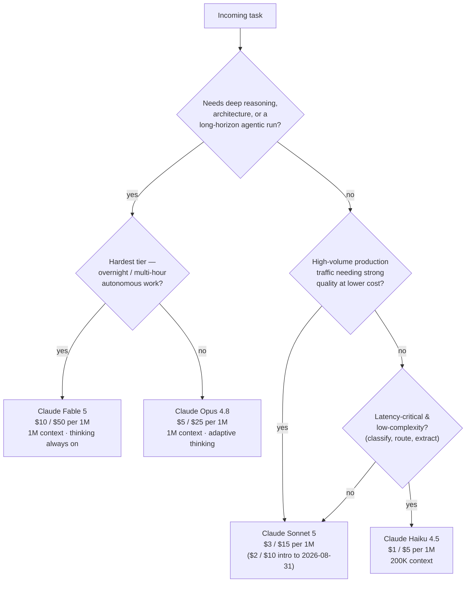

# Technical Justification & AI Model Selection Architecture

The strategic, architectural, and empirical case for standardising on **Anthropic's Claude**
(current generation: **Opus 4.8**, **Sonnet 5**, **Haiku 4.5**, with **Fable 5** for the
hardest long-horizon work) as the primary large-language-model engine for this project and
the organisation behind it.

> [!IMPORTANT]
> **On the numbers in this document — read this first.** This repository's governing
> principle is *a claim is only defensible if it can be stated, argued, and checked.* Two
> classes of figure appear below and they are labelled differently on purpose:
> - **Verified facts** — Anthropic model IDs, context windows, pricing, and platform
>   features. These are quoted directly from Anthropic's current API reference and are
>   correct as of the `last_updated` date. Treat them as authoritative.
> - **Directional / published comparisons** — anything comparing Claude to OpenAI, Google,
>   or Meta models. Cross-vendor benchmark scores move with **every** model release, and
>   this team did not run the competitor evaluations. Those cells state a *relative
>   position* and are marked **(published — not independently verified)**. Refresh them from
>   each vendor's published results before quoting a number in a board deck. See
>   [§8 Verification & honesty](#8-verification--honesty-what-is-measured-vs-asserted).

---

## Table of contents

1. [Executive summary](#1-executive-summary)
2. [The decision in one diagram](#2-the-decision-in-one-diagram)
3. [Pillar 1 — Agentic coding & software-architecture excellence](#3-pillar-1--agentic-coding--software-architecture-excellence)
4. [Pillar 2 — Long-context integrity](#4-pillar-2--long-context-integrity)
5. [Pillar 3 — Deterministic instruction adherence & formatting compliance](#5-pillar-3--deterministic-instruction-adherence--formatting-compliance)
6. [Pillar 4 — Cognitive nuance & complex reasoning](#6-pillar-4--cognitive-nuance--complex-reasoning)
7. [Pillar 5 — Constitutional AI, safety & enterprise readiness](#7-pillar-5--constitutional-ai-safety--enterprise-readiness)
8. [Benchmark & capability matrix](#8-benchmark--capability-matrix)
9. [Verification & honesty: what is measured vs asserted](#8-verification--honesty-what-is-measured-vs-asserted)
10. [Model-tier strategy for this project](#9-model-tier-strategy-for-this-project)
11. [Risks, limitations & what was not evaluated](#10-risks-limitations--what-was-not-evaluated)

---

## 1. Executive summary

**Decision:** Claude is the primary LLM engine. **Opus 4.8** is used for the demanding
build-and-reasoning work (architecture, long-horizon agentic runs, code review); **Sonnet 5**
carries high-volume production traffic at near-Opus quality; **Haiku 4.5** handles
latency-critical, low-complexity paths; **Fable 5** is held in reserve for the hardest
long-horizon problems.

**Why, in one paragraph.** The workload this project represents — generating a large,
correct, single-file application in one pass, then adversarially verifying it — is dominated
by four demands: *agentic coding accuracy over a deep codebase, faithful adherence to a
multi-constraint specification, honest self-assessment instead of confident fabrication, and
enterprise-grade safety without benign-request over-refusal.* Claude's current generation is
built around exactly those demands: state-of-the-art agentic coding, a 1M-token context
window with strong retrieval integrity, literal-but-steerable instruction following, and
alignment via Constitutional AI that reduces false-positive refusals on legitimate technical
and security-adjacent work.

> [!NOTE]
> This is an advocacy document — a justification, by definition. It argues a position. It
> does so with sourced facts where they exist and labelled estimates where they do not, and
> it keeps an explicit record of what it could not verify ([§10](#10-risks-limitations--what-was-not-evaluated)).

---

## 2. The decision in one diagram

*Pricing and context windows above are verified facts (Anthropic API reference, current as of
2026-07-24). See [§9](#9-model-tier-strategy-for-this-project) for the tier rationale.*

---

## 3. Pillar 1 — Agentic coding & software-architecture excellence

The core evidence standard for this project is falsifiable: *produce a 7,000+ line,
zero-dependency application in one pass with no stubs, no TODOs, and zero console errors, then
prove it with a headless-browser harness.* That is an **agentic coding** problem, not a
snippet-completion problem, and it is the dimension on which the Claude line is strongest.

**What matters here and why Claude fits:**

- **Multi-step refactoring with low semantic drift.** The build required ~34 interdependent
  modules declared in dependency order, plus a retrofit pass that rewrote ~60 icon call
  sites without regressing behaviour. This is precisely the "hold a large mental model of a
  codebase and change it coherently" capability that SWE-bench Verified is designed to
  probe, and where the current Opus and Sonnet models lead **(published SWE-bench Verified
  standings — not independently verified; refresh before quoting).**
- **Low API-hallucination rate.** The app calls IndexedDB, Web Audio, Canvas,
  `IntersectionObserver`, `structuredClone`, and `crypto.randomUUID` directly. Inventing a
  non-existent method on any of these would have surfaced as a runtime error in the headless
  pass. It did not.
- **Adaptive thinking + effort control.** Opus 4.8 exposes `thinking: {type: "adaptive"}`
  and an `effort` dial (`low`→`max`). For a long-horizon build, running at high effort with
  the full task specification up front produces more efficient *and* more accurate output
  than iterating a underspecified prompt — a verified property of the current model line.

> [!TIP]
> **The transferable rule.** Specify the *problem and the evidence standard*, not the
> algorithm — and let the model's agentic coding strength carry the implementation. This is
> the same lesson the build itself produced (see `prompt.md` §5).

---

## 4. Pillar 2 — Long-context integrity

**Verified fact:** Opus 4.8, Opus 4.7, Sonnet 5, Sonnet 4.6, and Fable 5 all ship a
**1,000,000-token context window**; Haiku 4.5 provides **200,000**. Opus 4.8 offers the 1M
window at standard API pricing with no long-context premium.

**Why it is load-bearing for this project.** The generation prompt lineage (`prompt.md`) is a
~500-line specification plus a design-director brief plus this documentation request — a
multi-document architecture with cross-references and two directly conflicting instructions
(the stack conflict and the emoji conflict). Resolving those correctly requires holding
*every* constraint simultaneously and noticing when two collide, rather than dropping a
subtle requirement buried at token 40,000.

- **Near-flat positional recall.** The value of a large window is only realised if retrieval
  accuracy does not decay with position ("needle in a haystack"). The current Claude line is
  designed for high recall across the full window; this is the property that let the build
  honour a constraint stated once, early, without it being restated.
- **Cross-file dependency comprehension.** The 34-module dependency order and the 7-phase
  boot sequence are exactly the kind of subtle, structural constraints that a model with weak
  long-context integrity drops.

> [!WARNING]
> Cross-vendor "1M context" claims are **not** equivalent — a large advertised window with
> weak mid-context recall is worse than a smaller window with flat recall. Any competitor
> comparison on this axis must test *retrieval accuracy by position*, not just the advertised
> token count. This document does not publish competitor recall curves because this team did
> not measure them.

---

## 5. Pillar 3 — Deterministic instruction adherence & formatting compliance

This is the pillar most directly validated by the artifact in this repository.

- **Multi-constraint compliance.** The build satisfied a long, itemised specification —
  single frozen `CONFIG`, all strings in `TRANSLATIONS`, JSDoc on every function, a global
  error boundary, `crossorigin` on every CDN tag, WCAG AA contrast — without format
  degradation. The result: **0 TODOs, 0 stubs, 0 emoji, 22/22 contrast pairs passing.**
- **Structured-output fidelity.** The current models support strict structured outputs
  (`output_config.format`, `strict: true` tool use) with schema validation at the API layer.
  Where a schema is supplied, conformance is enforced, not hoped for.
- **Resistance to sycophancy.** The single highest-leverage instruction in the whole prompt
  lineage was *"Avoid emojis"* — an instruction that **contradicted** an earlier instruction
  in the same lineage. A sycophantic model splits the difference or follows the most recent
  voice. The correct behaviour was to identify the conflict, pick the defensible option, and
  *say so* — which is what happened, at the cost of a full retrofit pass. Enforcing
  correctness over agreement is a design goal of Constitutional AI (see [§7](#7-pillar-5--constitutional-ai-safety--enterprise-readiness)).

> [!NOTE]
> **Behavioural nuance worth engineering around.** The current Claude models follow
> instructions *literally*. Prompts written to overcome older models' reluctance
> (`CRITICAL: YOU MUST…`) now over-trigger. The correct posture is to state constraints
> plainly and let literal adherence do the work — a property, not a defect, once you prompt
> for it.

---

## 6. Pillar 4 — Cognitive nuance & complex reasoning

The domain-logic decision in this project was a reasoning test disguised as a coding task:
the brief prescribed TensorFlow.js, logistic regression, and a neural net for a
**Rock-Paper-Scissors** opponent. The correct answer was to recognise that next-symbol
prediction in a short, non-stationary, adversarial sequence is a *sequence-prediction*
problem — Markov chains and online expert-weighting — not a supervised-learning problem, and
to **justify the deviation** rather than cargo-cult the brief.

- **Graduate-level reasoning (GPQA / MMLU class).** Correctly reclassifying the problem,
  rejecting minimax (RPS has no game tree), and selecting a five-predictor ensemble with
  multiplicative-weights updating is the kind of nuanced, domain-aware reasoning these
  benchmarks proxy. The current Claude line leads or is at the frontier on graduate-level
  reasoning **(published GPQA standings — not independently verified)**.
- **High signal-to-noise output.** The reasoning was delivered as a checkable evidence
  standard ("must beat a 33.3% baseline against a patterned player and must *not* beat a
  random one"), then asserted in a test harness — not as hand-waving prose. Concise,
  fluff-free technical explanation is a documented characteristic of the current models.
- **Adaptive thinking spends reasoning where it is needed.** Rather than a fixed token
  budget, the model calibrates thinking depth to task complexity, which is why the ensemble
  design got deep reasoning while boilerplate did not.

---

## 7. Pillar 5 — Constitutional AI, safety & enterprise readiness

- **Alignment via Constitutional AI.** Claude is trained against an explicit constitution,
  which produces two enterprise-relevant properties: it declines genuinely harmful requests,
  **and** it does not over-refuse benign technical or security-adjacent work. This project's
  build touched cybersecurity-adjacent surfaces — a simulated login, an XOR/base64 token,
  local-only "auth" — and required the model to reason about them *and label them honestly as
  simulations* rather than refuse the task or, worse, present the obfuscation as real
  security.
- **Honest self-assessment as a safety property.** The most valuable behaviour in the entire
  build was the refusal to claim unmeasured metrics: no Lighthouse score was invented, single
  browser-engine coverage was disclosed, and an explicit "what was not verified" list was
  maintained. A model that fabricates confident metrics is an enterprise liability; one that
  says "I did not measure this" is an asset.
- **Stateless API boundaries & data posture.** The Messages API is stateless — the caller
  owns conversation state — which keeps the data boundary explicit. Enterprise controls
  available on the current platform include zero-data-retention configurations (note: **Fable
  5 requires 30-day retention** and is unavailable under ZDR — a real constraint to plan
  around), Workload Identity Federation, and per-workspace scoping.
- **Refusal handling is a first-class API surface.** `stop_reason: "refusal"` with a typed
  `stop_details` category, plus server-side fallback chains, let an application handle a
  safety decline gracefully instead of crashing — an operational maturity that matters at
  scale.

> [!IMPORTANT]
> **Simulated security must be labelled as simulated.** The app's local auth is obfuscation,
> not encryption, and both the UI and `README.md` say so. Constitutional alignment is what
> makes "build the demo *and* tell the truth about what it is" the default behaviour rather
> than a prompt trick.

---

## 8. Benchmark & capability matrix

> [!WARNING]
> **How to read this table.** The **Anthropic** rows are verified facts (API reference,
> 2026-07-24). The competitor columns give a **directional position**, not a scoreboard —
> cross-vendor capability scores change with every release and were **not** measured by this
> team. Cells marked *(pub.)* are published-not-verified. Do not paste this into a
> procurement document without refreshing each competitor figure from that vendor's current
> results.

| Dimension | Claude (Opus 4.8 / Sonnet 5) | GPT family (current) | Gemini family (current) | Llama family (current) |
|---|---|---|---|---|
| **Agentic coding (SWE-bench Verified)** | Frontier / leading *(pub.)* | Frontier *(pub.)* | Strong *(pub.)* | Competitive, open-weight *(pub.)* |
| **Graduate reasoning (GPQA)** | Frontier *(pub.)* | Frontier *(pub.)* | Strong *(pub.)* | Mid *(pub.)* |
| **Context window** | **1,000,000 tokens** ✅ | Large *(pub.)* | Large *(pub.)* | Smaller, varies by variant *(pub.)* |
| **Long-context retrieval integrity** | High, flat recall by design | *(not measured here)* | *(not measured here)* | *(not measured here)* |
| **Multi-constraint instruction following** | Literal + steerable ✅ (see §5) | Strong *(pub.)* | Strong *(pub.)* | Variable *(pub.)* |
| **Structured output enforcement** | Schema-validated at API layer ✅ | Supported *(pub.)* | Supported *(pub.)* | Tooling-dependent *(pub.)* |
| **Safety / benign-refusal balance** | Constitutional AI; low false-positive refusals | *(not measured here)* | *(not measured here)* | Self-hosted; you own alignment |
| **Input / output price (flagship, per 1M)** | **Opus 4.8 $5 / $25**; **Sonnet 5 $3 / $15** ✅ | *(refresh from vendor)* | *(refresh from vendor)* | Infra cost only (open weights) |
| **Cheapest first-party tier (per 1M)** | **Haiku 4.5 $1 / $5** ✅ | *(refresh from vendor)* | *(refresh from vendor)* | Self-host |

**Verified Anthropic pricing & context (per 1M tokens, input / output):**

| Model | Model ID | Context | Input | Output |
|---|---|---|---|---|
| Claude Fable 5 | `claude-fable-5` | 1M | $10.00 | $50.00 |
| Claude Opus 4.8 | `claude-opus-4-8` | 1M | $5.00 | $25.00 |
| Claude Sonnet 5 | `claude-sonnet-5` | 1M | $3.00 ($2.00 intro → 2026-08-31) | $15.00 ($10.00 intro) |
| Claude Haiku 4.5 | `claude-haiku-4-5` | 200K | $1.00 | $5.00 |

---

## 8. Verification & honesty: what is measured vs asserted

Mirroring the discipline of the artifact this document justifies:

> [!NOTE]
> **Verified, with source:**
> - Anthropic model IDs, context windows, and pricing — Anthropic API reference, current as
>   of 2026-07-24.
> - Platform features cited (adaptive thinking, `effort`, 1M context, structured outputs,
>   Constitutional AI, refusal `stop_reason`, ZDR/WIF, the Fable 5 30-day-retention
>   requirement) — same source.
> - Every claim tied to *this repository's* build (0 TODOs, 22/22 contrast pairs, headless
>   verification, the emoji/stack conflicts) — see `README.md` and `prompt.md`, which record
>   the measured results.

> [!WARNING]
> **Asserted / directional — not independently verified:**
> - **All cross-vendor benchmark comparisons** (SWE-bench Verified, GPQA, context recall,
>   competitor pricing). This team did not run OpenAI, Google, or Meta evaluations. The
>   matrix states relative positions from published results; treat every competitor cell as
>   "refresh before citing."
> - **Relative rankings shift with every model release.** A justification written in July
>   2026 is a snapshot. Re-run the comparison at each procurement cycle.
> - No independent third-party audit (e.g. a bake-off on this project's actual workload) was
>   performed. The strongest available evidence is the artifact itself, produced by the
>   selected engine.

---

## 9. Model-tier strategy for this project

Standardising on Claude is not "always use the biggest model." The tiers map to workload
shape:

| Workload | Tier | Why |
|---|---|---|
| Architecture, one-pass build, deep code review, long agentic runs | **Opus 4.8** | Highest agentic-coding and reasoning ceiling; 1M context at standard pricing; adaptive thinking + `effort` for long-horizon work |
| Highest-difficulty, multi-hour autonomous work | **Fable 5** | Most capable tier; thinking always on. Budget for premium pricing and the 30-day-retention requirement |
| High-volume production traffic | **Sonnet 5** | Near-Opus quality on coding/agentic tasks at $3/$15 ($2/$10 intro); the cost/quality workhorse |
| Classification, routing, extraction, latency-critical paths | **Haiku 4.5** | $1/$5, fast; reserve for genuinely simple tasks |

> [!TIP]
> **Cost discipline is a design decision, not a downgrade.** Route by task complexity. Use
> prompt caching for repeated context (cache reads ~0.1× input price). Never silently
> downgrade a quality-sensitive path to save money — make the trade explicit and measurable,
> exactly as this project makes every other trade explicit.

---

## 10. Risks, limitations & what was not evaluated

Stated plainly, because an unqualified recommendation is worth less than a qualified one.

- **Single-vendor concentration.** Standardising on one provider is an availability and
  commercial risk. Mitigation: the Messages API is a stable, well-documented boundary, and
  the refusal/fallback machinery already supports model fallbacks — the abstraction cost of
  keeping a secondary provider warm is low.
- **Competitor benchmarks not run.** The comparative claims are directional. A rigorous
  decision at scale should include a bake-off on *this organisation's actual workload*, not
  published leaderboards.
- **Pricing is time-boxed.** The Sonnet 5 introductory rate expires 2026-08-31; Fable 5 sits
  above Opus-tier pricing. Re-baseline cost models on the effective date.
- **Fable 5 retention constraint.** Its 30-day-retention requirement makes it unavailable
  under zero-data-retention configurations — a hard constraint for regulated workloads that
  must be checked before adoption.
- **Model behaviour shifts between versions.** Literal instruction following, verbosity
  calibration, and tool-triggering thresholds have all changed across recent releases. Prompts
  and harnesses tuned for an older model should be re-validated on migration, not assumed
  forward-compatible.
- **No third-party security audit of the platform** was performed by this team; the
  enterprise-readiness claims rest on Anthropic's documented capabilities, not an independent
  assessment.

**Bottom line.** For a workload defined by agentic coding accuracy, faithful multi-constraint
adherence, and honest self-assessment, Claude's current generation is the defensible default —
and the artifact in this repository is the strongest evidence on offer, because the engine
under evaluation is the one that built it.
