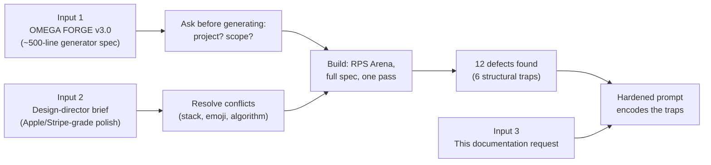

# Prompt

The prompt lineage that produced `index.html`, an honest critique of it, and a hardened
prompt you can reuse to reproduce this class of artifact without re-discovering the same
twelve bugs.



---

## Contents

1. [What was actually given](#1-what-was-actually-given)
2. [Critique: which instructions helped and which fought each other](#2-critique-which-instructions-helped-and-which-fought-each-other)
3. [The failure modes worth pre-empting](#3-the-failure-modes-worth-pre-empting)
4. [The hardened prompt](#4-the-hardened-prompt)
5. [How to adapt it](#5-how-to-adapt-it)

---

## 1. What was actually given

Three inputs, in order.

### 1.1 Input 1 — "OMEGA FORGE v3.0", a ~500-line generator template

A structured specification with ten sections: mandate, delivery format, a full BRD (12
functional + 8 non-functional requirements), tech stack with pinned CDN versions, a CSS
design system with named tokens, a 27-module JS architecture, a 7-phase boot sequence, an
event catalogue, page-by-page specs, an achievement system, and quality gates.

It arrived with its project slot unfilled: `[INSERT YOUR PROJECT NAME AND DESCRIPTION HERE]`.

> [!NOTE]
> **My response:** I did not guess. Generating 3,000+ lines against the wrong subject would
> have wasted the entire run, so I asked two questions with concrete options:
>
> - *What should be built?* → **Rock Paper Scissors AI**
> - *How should scope be handled given the spec asks for everything?* → **Full spec, one pass**

### 1.2 Input 2 — a design-director brief

A second prompt in a different register: Apple/Stripe/Linear/Vercel-grade polish, 8px
system, glassmorphism, motion design, WCAG AA, a premium component library, an icon
mandate, and a preferred stack of React/Next/TypeScript/Tailwind/Framer Motion.

It also contained two instructions in direct tension with the first prompt — see §2.

### 1.3 Input 3 — this documentation request

---

## 2. Critique: which instructions helped and which fought each other

An honest post-mortem of the prompts as engineering artifacts.

### 2.1 What worked exceptionally well

| Instruction | Why it worked |
|---|---|
| **Naming the module list explicitly** (27 named modules, in dependency order) | Removed all architectural ambiguity. Dependency order is genuinely load-bearing in a single-file build. |
| **The 7-phase boot sequence** | A single-file app has no framework lifecycle. Specifying phases prevented the classic "everything initialises in `DOMContentLoaded` and races" failure. |
| **Pinned CDN versions with a mandated fallback strategy** | Directly produced the degradation matrix. `chart.js@4.4.0` rather than `@latest` is why the build is reproducible. |
| **"If you feel yourself about to write `// TODO` — stop and implement it"** | Unusually effective. Names the failure mode *at the moment of temptation* rather than as an abstract goal. Final count: 0 TODOs. |
| **Demanding a single `CONFIG` object with no magic numbers** | Made the app genuinely configurable rather than nominally so. |
| **"Avoid emojis"** (brief 2) | The single highest-leverage instruction in either prompt. See §2.6. |

### 2.2 Stack vs. constraint

Brief 1: *"no npm, no build step, no server required."*
Brief 2: *"Prefer React, Next.js, TypeScript, Tailwind…"* These cannot both be satisfied.
Resolved by keeping the constraint that defines the artifact and implementing the
*principles* behind the stack directly.

> [!TIP]
> A prompt should state which constraint wins when two collide.

### 2.3 Line count as a proxy for completeness

*"MINIMUM SIZE: 3000+ lines."* Line count measures verbosity, not completeness. It rewards
repetition and punishes good abstraction. The build hit 7,482 lines by implementing the
feature list, not by targeting a number.

> [!TIP]
> **Better:** specify the capability list and let size fall out.

### 2.4 The emoji contradiction

Brief 1 mandates emoji as the icon strategy
(*"Lucide fails → Unicode emoji fallback"*, achievement `icon` fields, avatar pickers).
Brief 2 says *"Avoid emojis."* Brief 2 is correct, and the conflict cost a full retrofit
pass: 83 SVG paths authored, ~60 call sites rewritten, and a generated-identicon system to
replace 40 emoji avatars.

> [!WARNING]
> **Stating the icon strategy once, up front, would have saved that entire pass.**

### 2.5 Prescribing the wrong algorithm

Brief 1 asks for TensorFlow.js, logistic regression, gradient boosting, ROC-AUC and a
confusion matrix — and separately for "Minimax with alpha-beta pruning (unbeatable where
applicable)". For Rock Paper Scissors both are category errors: RPS has no game tree to
search, and next-symbol prediction in a short adversarial sequence is a
Markov/expert-weighting problem.

> [!IMPORTANT]
> A prompt should specify the *problem* and the *evidence standard*, not the algorithm.
> "The AI must measurably beat a 33.3% baseline against a patterned player and must not beat
> a random one" is a better instruction than any library name, because it is checkable.

### 2.6 Unverifiable quality gates

*"Lighthouse Performance > 95, Accessibility 100."* Real targets, but nothing in the
environment runs Lighthouse — so they can only be *claimed*, never met. This is how
documentation ends up dishonest.

> [!TIP]
> **Better:** require targets that the executing agent can actually measure, and require it
> to state what it could not verify. That reframing is what produced §12 of
> `justification.md`.

### 2.7 "Zero console errors" without a verification method

Achievable and correct, but it silently assumes the agent will run a browser. Stated as
*"prove it by loading every route in a headless browser with console capture"*, it becomes a
procedure instead of an aspiration — and that procedure is what caught 5 of the 12 logged
defects.

---

## 3. The failure modes worth pre-empting

This is the section with real transfer value: twelve bugs, of which six are *structural
traps* that any similar build will hit. Put these in the prompt and they never happen.

### 3.1 `file://` silently disables IndexedDB — no event ever fires

The highest-severity finding. On an opaque origin, Chrome's `indexedDB.open()` fires
**neither `onsuccess`, nor `onerror`, nor `onblocked`.** A standard promise wrapper never
settles, so `await openDB()` deadlocks the boot sequence permanently.

For an app whose entire premise is "double-click the file", this is fatal, and it will not
appear in any code review because the code is textbook-correct.

> [!WARNING]
> **Prompt rule:** every `Promise` wrapper around an event-driven browser API must race
> against a timeout and degrade. Never assume a handler fires.

### 3.2 `requestAnimationFrame` is starved in background tabs

Count-up animations that render `0 → target` via rAF leave the value at **0** if the tab is
backgrounded or rAF is throttled. The dashboard shows a wall of zeros beside sparklines
full of data.

> [!WARNING]
> **Prompt rule:** write the final value first; treat animation as enhancement. Guarantee
> the end state with a `setTimeout` fallback.

### 3.3 Replacing library defaults wholesale strips internal state

`Chart.defaults.animation = {duration, easing}` looks harmless and throws
`this._fn is not a function` on the first animation tick, because the animator reads
descriptors off the object you just replaced.

> [!WARNING]
> **Prompt rule:** mutate library default objects in place; retain the pristine reference
> if you need to toggle them.

### 3.4 Cross-origin scripts hide their errors

An exception thrown inside a CDN script surfaces as a bare `"Script error."` with no stack.
The Chart.js bug above was invisible until `crossorigin="anonymous"` was added to the script
tags.

> [!WARNING]
> **Prompt rule:** add `crossorigin="anonymous"` to every CDN `<script>` so errors are
> readable.

### 3.5 `AudioContext` before a gesture logs a warning on every load

Constructing an `AudioContext` eagerly — even inside a try/catch — produces a console
warning that violates a "zero console output" gate.

> [!WARNING]
> **Prompt rule:** gate construction behind an observed user gesture, not just a try/catch.

### 3.6 Self-seeded history triggers a celebration storm

Seeding 90 days of history legitimately satisfies a dozen achievement rules at once, firing
a dozen toasts and a dozen confetti bursts over the UI on first load.

> [!WARNING]
> **Prompt rule:** evaluate achievements silently until the app is ready; one celebration
> per batch.

### 3.7 The general lesson

> [!IMPORTANT]
> **Passing tests do not mean it looks right.** At one point this build had 37/37
> assertions green and 0 console errors — and the navigation read "dashboard Dashboard",
> every KPI showed 0, and light-mode charts had invisible gridlines. **Rendering a
> screenshot and looking at it is a distinct verification method.** It found four real bugs
> that automated testing reported as passing.

---

## 4. The hardened prompt

Reusable. Fill the four bracketed slots. Everything else is generic and encodes the twelve
defects above so they don't recur.

````markdown
# BUILD: [PROJECT NAME] — [ONE-LINE DESCRIPTION]

## 0. Non-negotiable constraint (wins every conflict)
Deliver ONE self-contained `index.html`. It must run by double-clicking the file:
no build step, no package manager, no server, no account. If any instruction below
conflicts with this, this wins — say so explicitly rather than silently choosing.

## 1. What to build
[PROJECT NAME]: [2–4 sentences on the domain, the user, and the core loop.]

Ship the complete feature set a best-in-class version would have. Every control must be
operational; no stubs, no TODOs, no placeholder copy, no example data arrays standing in
for computed values.

## 2. Ask before generating
If the project slot is unfilled or the scope is ambiguous, ASK before writing code.
Two or three concrete multiple-choice questions. Do not guess at a large deliverable.

## 3. Architecture
- Vanilla ES2022 in one IIFE. Named modules, declared in dependency order. No globals
  except a single debug handle.
- One frozen `CONFIG` object. No magic numbers anywhere else.
- All user-visible strings in a `TRANSLATIONS` table. No hardcoded UI copy.
- An explicit phased boot sequence — a single-file app has no framework lifecycle:
  error boundary → storage → config/theme → session → data → domain model → UI →
  background services.
- Global error boundary (`onerror` + `unhandledrejection`) with a circuit breaker.
- `try/catch` on every async function, storage write, chart construction and export.
- Guard every DOM query before use.
- JSDoc every function with `@param` / `@returns`.

## 4. Robustness rules (these encode real, observed failures — do not skip)
1. Every `Promise` wrapper around an event-driven browser API MUST race a timeout and
   degrade gracefully. On a `file://` origin, `indexedDB.open()` fires NO event at all —
   not success, not error, not blocked — and an unguarded `await` deadlocks the boot
   sequence forever.
2. Anything irreplaceable (user-generated records) must ALSO persist to `localStorage`.
   Deterministically regenerable data (seeded fixtures) need not.
3. Never animate a displayed value from zero as the only way it gets set. Write the final
   value first; layer animation on top; guarantee the end state with a `setTimeout`.
   `requestAnimationFrame` is starved in background tabs.
4. Mutate third-party default objects in place. Replacing them wholesale strips internal
   descriptors (e.g. `Chart.defaults.animation` → `this._fn is not a function`).
5. Add `crossorigin="anonymous"` to every CDN `<script>`, or cross-origin exceptions
   surface as an unreadable bare `"Script error."`.
6. Construct `AudioContext` only after an observed user gesture — a try/catch does not
   suppress the autoplay-policy warning.
7. Suppress celebratory UI (toasts, confetti) until the app is ready. Self-seeded history
   will satisfy many achievement rules at once and produce a storm on first load.
8. Pin CDN versions exactly. Give every external library an `onerror` handler and a
   named degradation path. State degraded mode in the UI.
9. Never write literal control characters into source. Use `\xNN` escapes.

## 5. Data
Self-seed on first run so no screen is ever empty. Use a seeded PRNG (state the seed) so
the corpus is reproducible. Note that anchoring timestamps to "now" makes any
calendar-derived logic (weekday/hour seasonality) date-dependent — so assert INVARIANTS in
tests (`rounds > 1500`), never exact observed counts, or the suite passes on the day it was
written and fails the next.

Model the data with real structure — behavioural archetypes, trends, seasonality, a stated
anomaly rate. Uniform random noise produces analytics pages that display nothing. Flag
synthetic records as synthetic and label them in exports.

## 6. Domain logic
[Describe the PROBLEM, not the algorithm. Choose the technique yourself and justify it.]

State the evidence standard the implementation must meet, e.g.:
> "Must measurably outperform a [BASELINE] against a patterned input, and must NOT
> outperform it against a random input. Assert both in the test harness."

Do not import a heavyweight ML runtime unless the problem genuinely calls for one; explain
the choice either way.

## 7. Design system
- ONE accent hue in three weights. No multi-hue brand palette.
- Desaturated semantic colours — they carry information, not decoration.
- A separate, perceptually spaced, colour-blind-safe data-visualisation ramp, defined in
  CSS custom properties and READ FROM CSS at runtime so charts recolour with the theme.
  Never hardcode chart colours; gridlines hardcoded white are invisible in light mode.
- 4px base, 8px cadence. Fixed px type sizes in dense UI — fluid `clamp()` type destroys
  vertical rhythm; reserve it for page titles and hero elements.
- `font-variant-numeric: tabular-nums` on every changing figure.
- Three elevation planes; one specular top-edge highlight per surface. Blur sparingly,
  always with a `@supports` fallback.
- Motion: ONE spring, ONE ease, three durations. Every animation must justify itself.
  Honour `prefers-reduced-motion` AND provide an in-app toggle.

## 8. Icons and identity — NO EMOJI ANYWHERE
Emoji render differently per platform, ignore `currentColor`, cannot be themed, and are
announced by screen readers. Author an inline SVG set instead: one grid, one stroke weight,
one join style, inheriting `currentColor`. Include any domain-specific marks the task needs.

Generate avatars deterministically (hash the name → gradient + monogram). Do not use emoji
or image assets for identity.

## 9. Accessibility — WCAG 2.1 AA, measured not assumed
- COMPUTE contrast ratios for every text/background token pair against EVERY surface the
  token appears on. Report the numbers. Fix anything below 4.5:1 for normal text.
  Micro-labels in muted greys are the usual failure and they fail everywhere at once.
- Skip link; full keyboard reachability; visible focus rings.
- Focus trap in modals, focus restored to the trigger on close.
- `aria-live` for dynamic results; `aria-sort`, `aria-pressed`, `aria-expanded`,
  `aria-current` where applicable.
- Colour NEVER the sole carrier of meaning — pair it with an icon and a text label.
- Charts need accessible labels and a data-table fallback.

## 10. Verification — perform it, then report it
Do not claim quality; demonstrate it.
1. Parse the extracted script (`node --check`).
2. Load EVERY route in a headless browser with console capture. Report errors AND
   warnings. Target zero.
3. Write a functional harness that drives the real app in the browser and asserts domain
   rules, persistence, filtering/sorting/pagination, exports and the evidence standard
   from §6. Report pass/fail counts.
4. Run it TWICE on the same browser profile to prove cross-reload persistence.
5. Compute the contrast table from §9.
6. RENDER SCREENSHOTS AND LOOK AT THEM, in both themes. Passing tests do not mean it looks
   right — tests verify behaviour, not appearance. Expect this step to find real bugs.

## 11. Honesty requirements
- State every deliberate deviation from this brief, with reasoning, when you make it —
  not afterwards.
- NEVER claim a metric you did not measure. If Lighthouse was not run, say no score is
  claimed. If only one browser engine was tested, say so.
- Maintain an explicit "what was not verified" section.
- If a security feature is simulated (local-only auth, obfuscated tokens), label it in the
  UI and the docs as a simulation, not a guarantee.

## 12. Output
`index.html` only, plus `README.md`, `justification.md`. No commentary before or after the
code.
````

---

## 5. How to adapt it

**Change these four things:**

| Slot | Example |
|---|---|
| `[PROJECT NAME]` / `[ONE-LINE DESCRIPTION]` | "Fleet Predictive Maintenance — ML-driven failure forecasting for a bus fleet" |
| §1 domain paragraph | The user, the core loop, the primary screen |
| §6 problem statement | The actual computational problem, with a baseline to beat |
| §6 evidence standard | The falsifiable claim the harness must assert |

> [!IMPORTANT]
> **Keep §4 and §10 verbatim.** They are domain-independent. §4 encodes six structural browser
> traps that cost real debugging time to find; §10 is the verification procedure that caught
> eleven of the twelve logged defects.

**Two closing observations.**

> [!TIP]
> *Specify the evidence standard, not the algorithm.* "Must beat a 33.3% baseline against a
> patterned player and must not beat a random one" produced a better AI than
> "use TensorFlow.js with Dense→Dropout→Dense" would have, because it is checkable and it
> leaves the implementation free to be correct.

> [!TIP]
> *Require the model to say what it didn't verify.* A quality gate that cannot be measured in
> the execution environment doesn't raise quality — it just moves the dishonesty into the
> documentation. Asking for an explicit gap list is what turns a confident-sounding report
> into a trustworthy one.
